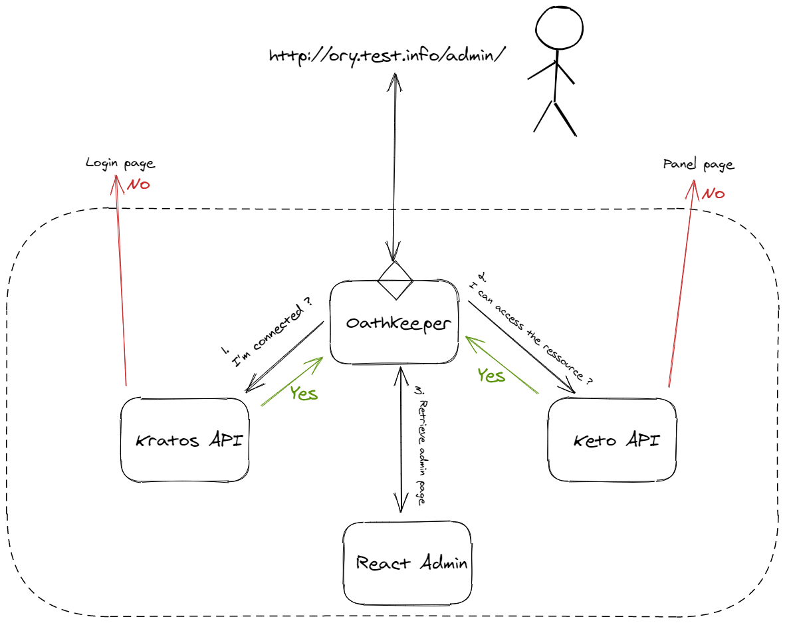

# Ory Kratos, Keto, and Oathkeeper with Kubernetes

This example show how create an SSO and ACL system with the Ory stack and
Kubernetes. It uses Nix to set up install kustomize and setup the minikube environment.

Adapted from [Ory examples repo](https://github.com/ory/examples/tree/master)

## Overview

This example uses the [kratos-selfservice-ui-node](https://github.com/ory/kratos-selfservice-ui-node), a fork of [mailslurper](https://github.com/pngouin/mailslurper) and a [react-admin app](https://github.com/pngouin/react-admin-ory) for the _admin_ page.

 _(This is an outline and does not exactly reflect
the reality of how the stack works)_

## Develop

### Prerequisites

- [nix package manager](https://nixos.org/download)

### Initial Setup

#### Step 1 Bootstrap the cluster
```bash
$ nix default.nix

# Create all resources
$ ./build.sh | kubectl apply -f -
```
#### Step 2 DNS Setup

To create a nice dev experience you should map your cluster ip to the DNS referenced within the examples.  `kubectl get ingress`  will give you the IP, which should be added to your host file.

```
$ kubectl get ingress
NAME               CLASS    HOSTS                 ADDRESS           PORTS   AGE
admin-ui-ingress   <none>   ory-admin.test.info   192.168.XXX.XXX   80      119s
fake-smtp-server   <none>   mail.test.info        192.168.XXX.XXX   80      119s
oathkeeper         <none>   ory.test.info         192.168.XXX.XXX   80      119s

# add ingress to the hosts file
$ sudo bash -c 'cat << EOF >> /etc/hosts
# ORY Minikube SSO stack
192.168.XXX.XXX    mail.test.info
192.168.XXX.XXX    ory.test.info
192.168.XXX.XXX    ory-admin.test.info
EOF'
```


#### (optional) Step 3 Create secret for fetching containers from ghcr.io

This step is only necessary if your docker installation has not already done a `docker login` e.g. `docker pull ghcr.io/hello-world` fails.
https://github.com/settings/tokens
You can create a token (it must be "classic") [in your Personal Access Token settings on github](https://github.com/settings/tokens); which only needs the `read:packages` scope.


```
$ kubectl create secret docker-registry dpr-secret --docker-server=https://ghcr.io --docker-username=mygithubusername --docker-password=mygithubreadtoken --docker-email=mygithubemail
```


#### Step 4 Create a test user.

Open your browser and navigate to `http://ory.test.info/panel/welcome` and
`http://mail.test.info`.

Go to `http://ory.test.info/panel/` and create an account. You can validate your
email on http://mail.test.info. When you create an account you have to add the
role `user` or `admin`. Only the admin role has the right to access the admin
react app.

| URL                                | Description                                               |
| :--------------------------------- | :-------------------------------------------------------- |
| http://ory.test.info/panel/welcome | User app for create an account, login, other              |
| http://ory.test.info/admin/        | Admin react app, you need the role `admin` to access      |
| http://mail.test.info              | Local mail panel, you will receive mail confirmation here |

##### Add keto relationships

After you have created a user, using the identity.id as the subject, you can add relations into [./keto/keto-job/config/relation-tuples/admin-access.json](./keto/keto-job/config/relation-tuples/admin-access.json)
And then update the keto policies.


```sh
# waits for Keto to be ready and add policies
$ ./add-keto-policies.sh | kubectl apply -f -
```

### Debugging

- Bring up a dashboard for the cluster with `minikube-dashboard`


- Get a db shell with [./_scripts/get_psql.sh](./_scripts/get_psql.sh)

